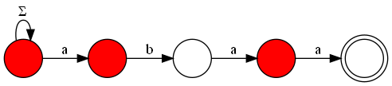

+++
title = "An Alternative Interpretation for the KMP Algorithm"
date = 2021-05-24
[taxonomies]
categories = ["automata", "strings"]
tags = ["kmp", "nfas", "automata"]
+++

Originally written in [github](https://gist.github.com/LeoRiether/c61b7f709b7826f47bc67f0c5d0d9b6b).
This article assumes you already know DFAs and NFAs (including subset construction).

## The Problem
We want to solve the string matching problem: given two strings `S` and `P`, find all substrings of `S` that match the pattern `P`. There are other uses for the concepts shown here, but we'll focus on this one first.

## A Simple Solution
There's a pretty simple NFA construction that solves this exact problem. We'll "feed" this automaton the characters of `S` as input, and if at any point a thread is at the accepting state, we'll know there's a substring that matches `P`. Let the starting state have an edge for every character of the alphabet (the alphabet of the automaton, not necessarily the english alphabet). This loop will create a thread at every input and leave it there, at the starting node, ready to match the pattern when the other inputs come. Next, we'll make a path containing the characters of the pattern `P` at every edge. Here's an example of an NFA that matches the pattern "abacaba":

Notice that the Σ edge in the first node represents "an edge for every symbol of the alphabet", and that includes the symbol "a". Thus, if the automaton receives an "a", the thread in the first node splits into one for the second node and one that keeps looping on the starting node. When this split occurs, one of the threads will keep walking to the right while the symbols of the string are matching the forward edges, but if at any point they don't match, the thread dies. Take a moment to appreciate how this simple NFA solves the matching problem.

## An Example
Let's look at an automaton that matches the pattern "abaa". The nodes filled in red represent alive threads. 

We'll input the string "abaab" and see how the threads behave. First, let's input the letter "a".

The thread we had before split into two, and now the one on the right will try to walk to the right as far as it can. Now we input the second character of our string, "b".

Nothing surprising here. Let's input "a".

Now there are 3 threads, look at them go! Now input another "a".

Notice that the thread that was on the second node didn't have any edge to follow, so it died, but then the first node split and another thread is now at the second state. Also, we have a filled accepting state, so there's a match with the pattern "abaa"! One last input, "b".

We already have a thread matching the "b" from "abaa", even if this first "a" overlaps with our first match. This kind of behaviour allows us to match overlapping patterns efficiently.

## Running the Automaton
The naive way to run this automaton is to keep a set of threads and advance them individually. This is, however, not efficient at all. Imagine the pattern is something like "aaaaaa", and we match a string "aaaaaaaaaaaaaaaaa". At every iteration a new thread would be spawned and every other thread would advance, with no deaths. This gives us a time complexity of O(|S| × |P|). We can do better by exploiting some properties.

### How many states are reachable?
Theres' potential to do better than the naive simulation by analyzing the subset construction of our NFA. Indeed, only `|P|+1` states would be reachable in it! The proof is as follows: imagine we've input some string to the automaton and there's some set of alive threads. Let `u` be the most advanced (closest to the right) thread alive -- we'll call it the "leader" thread --, and let `n` be the number of forward edges (the ones that aren't the loop) it followed. There are no threads to the right of `u`, so we only need to consider the last `n` symbols the automaton has seen, and there's only one length-n string possible because there's only one path the thread could have followed. Because of that, the alive threads to the left of `u` are uniquely determined! In other words, if we know the leader, there's only one possible set of alive threads to the left of it. With this, it's possible to conclude that there's exactly one reachable subset in the subset construction for every leader state, which gives us `|P|+1` states in total.

An idea one could have now is: when simulating the automaton, what if we only keep track of the leader thread, instead of the entire alive subset? This is exactly what we'll do, but there's a problem: what if the leader dies? We need to know who will occupy his place. Before that, though, we'll need one more concept.

### Left-set
It turns out that "there's only one possible set of alive threads to the left of the leader" does not apply exclusively to the leader. In fact, if we know some thread is alive, all of the threads to the left of it can be uniquely determined. The argument is very similar to the one shown before, here's a sketch: if a thread is alive in node `n`, then there's one possible string of length `n` that must have been fed to the automaton in the last `n` steps, thus the threads in smaller positions must have come from this string.

Now we can finally know what to do in the case of a failed match.

### Dealing with failure
Suppose we've built the automaton for "abababax" and fed "abababa" to it. 

What would happen if we input the letter "b"? Well, the leader can't go forward, so it dies. The thread immediately to the left of the leader, however, can go forward, and thus becomes the new leader. We'll call this "thread immediately to the left of a thread" the "neighbor". This idea outlines a possible efficient way of simulating our NFA. We'll keep track of the leader at every step. How? There are two cases:
1. The leader matches the input and goes forward. This case is easy, just increment the current leader.
2. The leader fails to match and dies. Then, the neighbor of the leader (call him `n0`) may or may not survive. If it does, the new leader is `n0+1`. If it dies, then maybe the neighbor of `n0` (call him `n1`) survives. If it does, the new leader is `n1+1`. If it dies, then maybe the neighbor of `n1` survives. You get the idea. If we could know the neighbor of a thread in `O(1)`, the entire matching process would take time `O(|S|)`. Yes, even if we walk through neighbors one by one as they die, the algorithm runs in linear time. To see why, consider that we spawn at most one thread per step, so the total number of dead threads is bounded by `|S|`. It's like pushing threads to a queue when they are spawned and popping the queue when they die.

### Precalculating the Neighbor 
